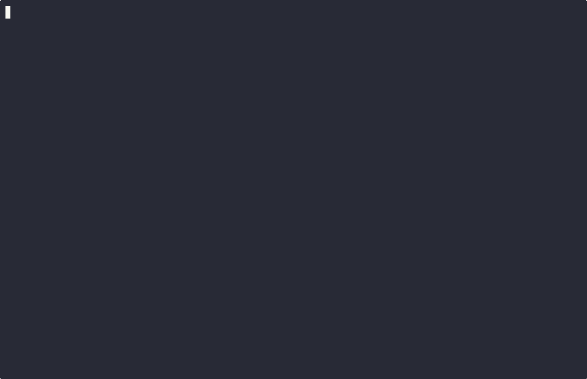

# CQ - Python Code Quality Analysis Tool

[](https://github.com/rhiza-fr/py-cq/actions/workflows/ci.yml)
[](https://codecov.io/gh/rhiza-fr/py-cq)
[](https://pypi.org/project/python-code-quality/)
[](https://pypi.org/project/python-code-quality/)
[](LICENSE)

Run 11+ code quality tools, aggregate results into one score, and surface the single most critical defect as a focused markdown prompt — ready to pipe to any LLM.

This can dramatically reduce the amount of noise for LLMs (and humans) and remove the need for them to know about these tools.

Note: It never edits your files. This is a job for you or an LLM. You may wish to run `ruff check --fix` and `ruff format` first.

```bash
cq check . -o llm     # top defect as markdown, pipe to an LLM
cq check .            # table overview of all scores
cq check . -o score   # numeric score only, exits 1 on errors (CI gate)
```



## Install

```bash
# install the `cq` command line tool from PyPi
uv tool install python-code-quality

# or, clone it then install 
git clone https://github.com/rhiza-fr/py-cq.git
cd py-cq
uv tool install .
```

## Tools

These tools are run in **parallel** except:
When running '-o llm', we run sequentially and exit early at the first error.

| Order | Tool | Measures |
|----------|------|----------|
| 1 | compileall | Syntax errors |
| 2 | ruff | Lint / style |
| 3 | ty | Type errors |
| 4 | bandit | Security vulnerabilities |
| 5 | pytest | Test pass rate |
| 6 | coverage | Test coverage |
| 7 | radon cc | Cyclomatic complexity |
| 8 | radon mi | Maintainability index |
| 9 | radon hal | Halstead volume / bug estimate |
| 10 | vulture | Dead code |
| 11 | interrogate | Docstring coverage |

Diskcache is used to cache tool output for lightning fast re-runs. Sane defaults: <100 Mb, <5 days, No pickle risk.


## Usage

```bash
cq check .                 # Table overview of scores for humans
cq check . -o llm          # Top defect as markdown for LLMs
cq check . -o llm-json     # Top defect as JSON with fingerprint (for automation)
cq check . -o score        # Numeric score only for CI
cq check . -o json         # Detailed parsed JSON output for jq
cq check . -o raw          # Raw tool output for debug
cq check path/to/file.py   # Just one file (skips pytest and coverage)
cq check . --only ruff,ty  # Run only specific tools
cq check . --skip bandit   # Skip specific tools
cq check . --exclude demo  # Exclude paths from all tools
cq check . --workers 1     # Run sequentially if you like things slow
cq check . --clear-cache   # Clear cached results before running (rarely needed)
cq check . -o llm --hint   # Append "run cq again to verify" (for human workflows)
cq config path/to/project/ # Show effective tool configuration
cq is-fixed <fingerprint>  # Check whether a specific issue has been resolved
```

**Exit codes:** `cq check` exits with code `1` if any tool metric falls below its `error_threshold`, making it suitable as a CI gate:

```bash
cq check . && deploy        # block deploy on errors
cq check . -o score         # print score, exit 1 on errors
```

## Fingerprint-based verification

`-o llm-json` returns a JSON object with a stable `id` fingerprint you can pass back to `cq is-fixed` to check whether a specific issue has been resolved — without re-running all tools:

```bash
# Get the top defect as JSON
cq check . -o llm-json
```

```json
{
  "id": "ruff::my-project::src/foo.py::42::E501",
  "file": "src/foo.py",
  "project": "/home/user/my-project",
  "message": "..."
}
```

```bash
# After fixing, verify only that issue (fast — reruns one tool on one file)
cq is-fixed "ruff::my-project::src/foo.py::42::E501"
```

This is most useful in automation: fix an issue, confirm it's gone, then fetch the next one. Note that this only verifies the original issue is no longer present — a full project-wide scan is still needed to guarantee no regressions, assuming you have sufficient tests.

## Python Library

`py_cq` can be used as a library — no subprocess required. Instantiate `CQ` with a project root; config is loaded once from `pyproject.toml`.

```python
from py_cq import CQ

cq = CQ(".")                      # load config from ./pyproject.toml
cq = CQ(".", skip=["bandit"])     # skip specific tools
cq = CQ(".", only=["ruff", "ty"]) # run only specific tools
cq = CQ(".", workers=4)           # control parallelism
```

**Methods mirror the CLI and return data objects:**

```python
# list[ToolResult] — all parsed results before aggregation (-o raw / -o json)
results = cq.raw()

# CombinedToolResults — aggregated score and per-tool results (-o score / table)
combined = cq.check()
print(combined.score)          # float
print(combined.tool_results)   # list[ToolResult]

# dict — top defect as JSON, equivalent to -o llm-json
issue = cq.check_llm_json()
issue["id"]       # fingerprint: "ruff::project::src/foo.py::42::E501"
issue["file"]     # "src/foo.py"
issue["message"]  # markdown prompt ready to send to an LLM
issue["project"]  # absolute project root path

# bool — True if the fingerprinted issue is gone
# Reruns only the affected tool on the affected file — much faster than a full check.
# Pass the id from check_llm_json; also available as `cq is-fixed <id>` on the CLI.
fixed = cq.is_fixed(issue["id"])
```

`check_llm_json` accepts the same options as `cq check . -o llm-json`:

```python
issue = cq.check_llm_json(limit=3, silence=["src/generated.py"], hint=True)
```

**Typical automation loop:**

```python
from py_cq import CQ

cq = CQ(".")
while True:
    issue = cq.check_llm_json()
    if issue["id"] is None:
        break                        # all clear
    fix(issue["message"])            # call your LLM
    assert cq.is_fixed(issue["id"])
```

## Claude Code Integration

Add a stop hook to your project's `.claude/settings.json` so Claude automatically checks quality after each session and loops until clean:

```json
{
  "hooks": {
    "Stop": [
      {
        "matcher": "",
        "hooks": [
          {
            "type": "command",
            "command": "cq check . -o score && echo 'CQ: all clear' || cq check . -o llm; true"
          }
        ]
      }
    ]
  }
}
```

When the score passes, Claude sees `CQ: all clear` (~5 tokens). When it fails, Claude receives the targeted fix prompt and continues working. This automates the `cq check . -o llm | claude -p "fix this"` loop.

> **Note:** Use project-level `.claude/settings.json`, not global settings — this hook only makes sense in Python projects.

### As a slash command (skill)

For manual invocation, create `.claude/commands/cq-fix.md`:

```markdown
$(cq check . -o llm)
```

Then invoke it with `/cq-fix` in Claude Code. The `$(...)` embeds the live `cq` output directly into the prompt before Claude starts, so it sees the issue immediately without an extra tool call.

**Hook vs skill:**
- **Stop hook** — automatic, runs after every session, best for unattended loops
- **Skill** — manual `/cq-fix`, gives you explicit control over when to check

## Table output

```bash
> cq check .
```

```python
┏━━━━━━━━━━━━━━━━━━┳━━━━━━━━━━┳━━━━━━━━━━━━━━━━━━━━━━━━━━━┳━━━━━━━━━┳━━━━━━━━━━┓
┃ Tool             ┃     Time ┃                    Metric ┃ Score   ┃ Status   ┃
┡━━━━━━━━━━━━━━━━━━╇━━━━━━━━━━╇━━━━━━━━━━━━━━━━━━━━━━━━━━━╇━━━━━━━━━╇━━━━━━━━━━┩
│ compile          │    0.42s │                   compile │ 1.000   │ OK       │
│ ruff             │    0.17s │                      lint │ 1.000   │ OK       │
│ ty               │    0.33s │                type_check │ 1.000   │ OK       │
│ bandit           │    0.56s │                  security │ 1.000   │ OK       │
│ pytest           │    0.91s │                     tests │ 1.000   │ OK       │
│ coverage         │    1.26s │                  coverage │ 0.910   │ OK       │
│ radon cc         │    0.32s │                simplicity │ 0.982   │ OK       │
│ radon mi         │    0.38s │           maintainability │ 0.869   │ OK       │
│ radon hal        │    0.30s │             file_bug_free │ 0.928   │ OK       │
│ radon hal        │          │            file_smallness │ 0.851   │ OK       │
│ radon hal        │          │        functions_bug_free │ 0.913   │ OK       │
│ radon hal        │          │       functions_smallness │ 0.724   │ OK       │
│ vulture          │    0.32s │                 dead_code │ 1.000   │ OK       │
│ interrogate      │    0.36s │              doc_coverage │ 1.000   │ OK       │
│                  │          │                     Score │ 0.965   │          │
└──────────────────┴──────────┴───────────────────────────┴─────────┴──────────┘
```

## Single score output
```bash
> cq check . -o score
```
```
0.9662730667181059 # this is designed to approach but not reach 1.0
```

## Json output
```bash
> cq check . -o json
```

```json
[
  {
    "tool_name": "compile",
    "metrics": {
      "compile": 1.0
    },
    "details": {},
    "duration_s": 0.05611889995634556
  }
  ...
]
```

## Raw output
```bash
> cq check . -o raw
```

```json
[
  {
    "tool_name": "compile",
    "command": "D:\\ai\\py-cq\\.venv\\Scripts\\python.exe -m compileall -r 10 -j 8 . -x .*venv",
    "stdout": "",
    "stderr": "",
    "return_code": 0,
    "timestamp": "2026-02-20 10:01:22"
  }
  ...
]
```

Both `json` and `raw` output pipe cleanly to `jq`:

```bash
# Get the coverage section
cq check . -o raw | jq '.[] | select(.tool_name == "coverage")'

# Get parsed coverage metrics only
cq check . -o json | jq '.[] | select(.tool_name == "coverage") | .metrics'
```

## Configuration

Add a `[tool.cq]` section to your project's `pyproject.toml`:

```toml
[tool.cq]
# Skip tools that are slow or not relevant to your project
disable = ["coverage", "interrogate"]

# Exclude paths from all tools (merged with --exclude CLI flag)
exclude = ["demo", "docs"]

# Lines of source context shown around each defect in LLM output (default: 15)
context_lines = 15

# Override warning/error thresholds per tool
[tool.cq.thresholds.coverage]
warning = 0.9
error = 0.7
```

Tool IDs match the keys in `config/config.yaml`: `compile`, `ruff`, `ty`, `bandit`, `pytest`, `coverage`, `radon-cc`, `radon-mi`, `radon-hal`, `vulture`, `interrogate`.


### Default config

```yaml
python:

  compile:
    command: "{python} -m compileall -r 10 -j 8 \"{context_path}\" -x .*venv"
    parser: "CompileParser"
    order: 1
    warning_threshold: 0.9999
    error_threshold: 0.9999

  ruff:
    command: "{python} -m ruff check --output-format concise --no-cache \"{context_path}\"{exclude}"
    exclude_format: " --exclude {path}"
    parser: "RuffParser"
    order: 2
    warning_threshold: 0.9999
    error_threshold: 0.9

  ty:
    command: "{python} -m ty check --output-format concise --color never \"{context_path}\"{exclude}"
    exclude_format: " --exclude {path}"
    parser: "TyParser"
    order: 3
    warning_threshold: 0.9999
    error_threshold: 0.8
    run_in_target_env: true
    extra_deps:
      - ty

  bandit:
    command: "{python} -m bandit -r \"{context_path}\" -f json -q -s B101 --severity-level medium --exclude \"{input_path_posix}/.venv,{input_path_posix}/tests{exclude}\""
    exclude_format: ",{input_path_posix}/{path}"
    parser: "BanditParser"
    order: 4
    warning_threshold: 0.9999
    error_threshold: 0.8

  pytest:
    command: "{python} -m pytest -v \"{context_path}\"{exclude}"
    exclude_format: " --ignore {path}"
    parser: "PytestParser"
    order: 5
    warning_threshold: 1.0
    error_threshold: 1.0
    run_in_target_env: true
    extra_deps:
      - pytest

  coverage:
    command: "{python} -m coverage run --omit=*/tests/*,*/test_*.py -m pytest \"{context_path}\" && {python} -m coverage report --omit=*/tests/*,*/test_*.py"
    parser: "CoverageParser"
    order: 6
    warning_threshold: 0.9
    error_threshold: 0.5
    run_in_target_env: true
    extra_deps:
      - coverage
      - pytest

  radon-cc:
    command: "{python} -m radon cc --json \"{context_path}\""
    parser: "ComplexityParser"
    order: 7
    warning_threshold: 0.6
    error_threshold: 0.4

  radon-mi:
    command: "{python} -m radon mi -s --json \"{context_path}\""
    parser: "MaintainabilityParser"
    order: 8
    warning_threshold: 0.6
    error_threshold: 0.4

  radon-hal:
    command: "{python} -m radon hal -f --json \"{context_path}\""
    parser: "HalsteadParser"
    order: 9
    warning_threshold: 0.5
    error_threshold: 0.3

  vulture:
    command: "{python} -m vulture \"{context_path}\" --min-confidence 80 --exclude .venv,dist,.*_cache,docs,.git{exclude}"
    exclude_format: ",{path}"
    parser: "VultureParser"
    order: 10
    warning_threshold: 0.9999
    error_threshold: 0.8

  interrogate:
    command: "{python} -m interrogate \"{context_path}\"{exclude} -v --fail-under 0"
    exclude_format: " -e {path}"
    parser: "InterrogateParser"
    order: 11
    warning_threshold: 0.8
    error_threshold: 0.3
```

## Respect

Many thanks to all the wonderful maintainers of :

- [compileall](https://docs.python.org/3/library/compileall.html)
- [bandit](https://github.com/PyCQA/bandit)
- [ruff](https://github.com/astral-sh/ruff)
- [ty](https://github.com/astral-sh/ty)
- [pytest](https://github.com/pytest-dev/pytest)
- [coverage.py](https://github.com/nedbat/coveragepy)
- [radon](https://github.com/rubik/radon)
- [vulture](https://github.com/jendrikseipp/vulture)
- [interrogate](https://github.com/econchick/interrogate)
- [diskcache](https://github.com/grantjenks/python-diskcache)
- [typer](https://github.com/fastapi/typer)
